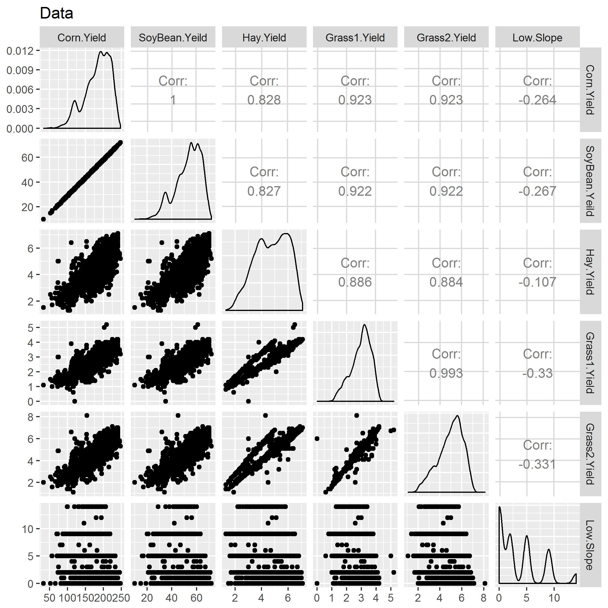
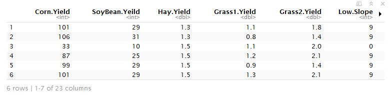
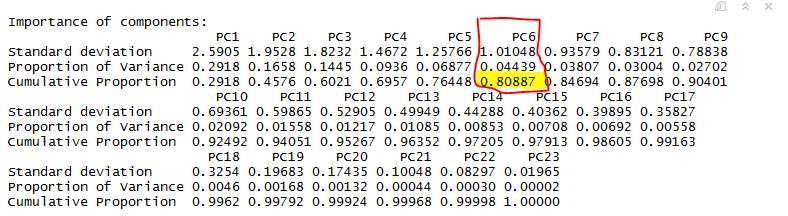
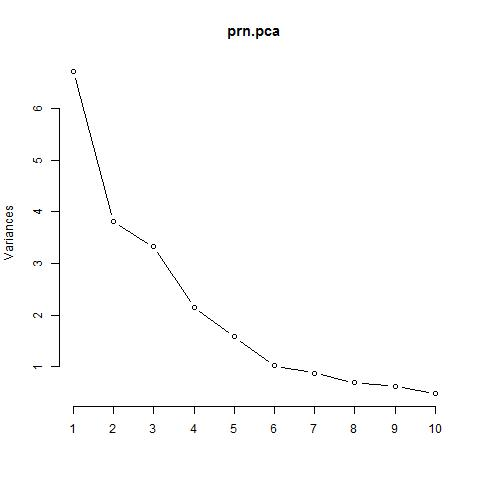
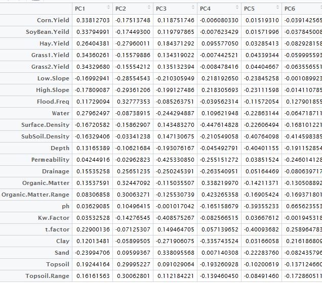

## Principal component analysis can be your answer


I've been involved quite a few statistical projects in past. Where either the dimension of explanatory variables was a problem or multicollinearity was an issue. I want to share my experience by going through  a simple example how PCA (Principal component analysis) can help to achieve both those goals. It is practically not possible to cover both diagnostic analysis,  regression and visualization in one blog.

I will be laying emphases on dimension reduction and multicollinearity.

##### PCA Brief

PCA helps to reduce the no of variables, by not losing much of information. Large complex data can be analyzed smaller and understandable data set.

PCA is also used when there is high amount of correlation between explanatory variables. It removes the multicollinearity. There has been a lot of research done in this field. PCA is also one of the leading unsupervised learning techniques. I am going to explain this further in what conditions where I will use PCA.
I will discuss this using R and how it can be used effectively.

#### Running through an example

The data set I'm using is in my analysis is **corn** data set. Iowa state **[Link to data](http://www.agronext.iastate.edu/)** is one of the leading corn producer. To evaluate the overall quality of soil, **23 explanatory variables** was used. Varibles like slope of land, water infiltration  to name a few.
Scree and variance plots will be created.

#### Snapshot of the correlation matrix



If you see above there seems to be high multicollinearity between the explanatory variables. It is very high, and because of that estimates will be inflated. To fixed this we can either use  **Ridge Regression** or, do **PCA** because of high VIF, but multicollinearity was still a problem.

**Code**

```
prn<-read.csv('corn.csv')

## Checking multicollinearity

ggpairs(data=prn, # data.frame with variables
        columns=c(2,3,4,5,6,7), # columns to plot, default to all.
        title="Data")+ggsave("corr.jpg")        
}
```


**Code**

Splitting explanatory variables and response variables

```
prn_expl <- (prn[, 2:24])

prn_response <- prn[,1]

```

##### Explanatory variables




##### Running PCA

```
prn.pca <- prcomp(na.omit(prn_expl),scale=TRUE)

summary(prn.pca)

```

**Table Below **




## Scree Plot




##### Analysis

From above we can very well see, importance of the PCs. Last row in the table describes cumulative proportion of explained variance. We can see  that first six PC's account for almost 80% of the variance of the data.  We can also see that from **scree plot**, there is a big bend at 6. Maximum variance can be explained.

**Code**

```
#Using
a1 <- prn.pca$rotation[,1:6]
a1

```

**Principal componet analysis table**





##### Final note

As we have seen  above in the **PCA**  analysis. PCA not only removes  multicollinearity but also reduces the dimension. There is always a trade off, when you use, PCA  as it only be used in building a model for prediction/ It cannot be used for finding significant predictors, and it can be sometime difficult to interpret.  

I will be doing separate blog, on regression analysis and on visualization using the same dataset running PCA regression.


##### References

 [https://stat.ethz.ch](https://stat.ethz.ch/R-manual/R-devel/library/stats/html/prcomp.html)

 [http://www.sthda.com](http://www.sthda.com/english/wiki/principal-component-analysis-in-r-prcomp-vs-princomp-r-software-and-data-mining)
